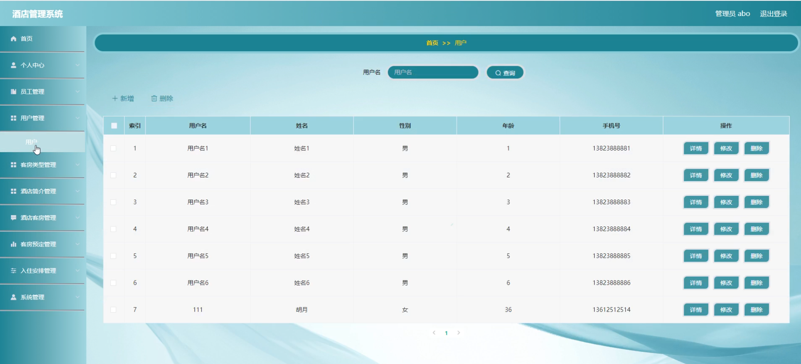

# 毕业季采用基于springboot的酒店管理系统为毕业设计-轻松解决毕业设计

---
### 👉作者QQ ：1556708905 微信：zheng0123Long (支持定制修改、部署调试、定制毕设)

### 👉接网站建设、小程序、H5、APP、各种系统等

---

#### 介绍

介绍一款酒店管理系统的毕业设计，轻松解决毕业设计。基于springboot的酒店管理系统是一款全面集成的管理平台，旨在提升酒店的运营效率和用户体验。该系统支持管理端、员工端和用户端三种角色，分别满足酒店管理、员工操作和用户预订的需求。通过对客房、预订、入住等核心业务的系统化管理，该平台实现了酒店管理的数字化和信息化，优化了服务流程，提升了服务质量。

#### 研究背景

计算机类的管理系统可以帮助人们的工作管理以及生活管理，目前各种管理系统已布满人们的整个生活。计算机类的管理系统还需要网络的支持，近年来，网络发展非常成熟，网速可以达到5G。无论街边小贩还是高档商场都布置了无线网络，网络可以实现信息接收、传递。管理系统和网络相辅相成，减少了工作量，实现了信息的自动化管理。但现在，还有很多事务采用传统的人工手段进行办公管理，有些行业离不开传统方式，比如对于重要事务还需要面对面商讨，所以现在企业中大部分采用传统方式+新型方式的办公手段。
酒店为生活中最常见的设施，来预定酒店的人为全世界各地人世，酒店做为东道主更需要严格管理酒店的所有事项，保证来入住用户的人身安全以及带给他们享受。由于酒店的工作非常多，固定的管理方式根本满足不了需求，需要引入新的管理方式来协助，为了保证安全，对入住人员管控也需要严格把关。大量的入住人员如何才能保证有序安排，如何才能快速审核用户的预定信息是负责酒店管理人员的最大的问题。

#### 技术栈

后端技术栈：Springboot+Mysql+Maven

前端技术栈：Vue+Html+Css+Javascript+ElementUI

开发工具：Idea+Vscode+Navicate

#### 系统功能介绍

管理端功能模块  
个人中心：管理员可以查看和更新个人信息，包括用户名、密码等，确保账户安全。  
员工管理：管理员可以添加、删除和管理员工信息，分配员工角色和权限。  
用户管理：管理员可以查看和管理用户的注册信息，确保用户数据的准确和安全。  
客房类型管理：管理员可以添加和管理不同类型的客房信息，确保客房数据的完整性和准确性。   
酒店简介管理：管理员可以编辑和更新酒店的简介信息，包括酒店概况、服务设施等，向用户展示酒店的整体形象。  
酒店客房管理：管理员可以查看和管理酒店的所有客房信息，包括客房状态、价格等，确保客房信息的实时更新。  
客房预定管理：管理员可以查看和管理所有的客房预订信息，审核预订请求并进行确认或取消操作。  
入住安排管理：管理员可以查看和管理客人的入住安排，包括入住时间、房间分配等，确保入住过程的顺利进行。  
系统管理：管理员可以进行系统设置和管理，包括权限配置、系统日志查看等，确保系统的正常运行和安全性。  

员工端功能模块  
酒店简介：员工可以查看酒店的简介信息，了解酒店的基本情况和服务设施。  
酒店客房：员工可以查看和管理酒店的客房信息，了解客房状态和预订情况。  
酒店公告：员工可以查看酒店发布的公告信息，了解最新的工作安排和通知。  
个人中心：员工可以查看和更新个人信息，包括用户名、密码等，确保账户安全。  
后台管理：员工可以进行以下操作：  
酒店客房管理：员工可以查看和管理酒店的客房信息，确保客房信息的准确性。  
客房预定管理：员工可以查看和管理客房的预订信息，处理预订请求并进行确认或取消操作。  
入住安排管理：员工可以查看和管理客人的入住安排，确保入住过程的顺利进行。  

用户端功能模块  
酒店简介：用户可以查看酒店的简介信息，了解酒店的基本情况和服务设施。  
酒店客房：用户可以浏览和搜索酒店的客房信息，查看客房的详细介绍和预订情况。  
酒店公告：用户可以查看酒店发布的公告信息，了解最新的活动和优惠信息。  
个人中心：用户可以查看和更新个人信息，包括用户名、密码等，确保账户安全。  
后台管理：用户可以进行以下操作：  
酒店客房管理：用户可以查看自己预订的客房信息，管理预订状态。  
客房预定管理：用户可以提交和管理客房预订请求，查看预订的确认和取消情况。  
入住安排管理：用户可以查看和管理自己的入住安排，确保入住过程的顺利进行。  

#### 系统功能结构设计

功能结构为系统功能的展示，一般采用树形图进行系统功能的结构描述。第一层为系统的名称，第二层为划分的功能界面，第三层为功能界面里的详细功能。本系统的功能结构图第一层为酒店管理系统，第二层为前台、用户、管理员、员工，第三层为相对应的具体功能。本系统的功能结构图如下：

#### 系统操作流程分析

一个受欢迎的系统必然有一个好的系统操作流程，简单、友好的操作流程才可以使用户更快速的满足自己的要求。系统的操作流程正确系统的数据才可以被正确调用。从数据的来源到去处进行分析形成数据的闭环。本系统的操作流程为游客注册为用户，用户浏览客房信息完成预定，管理员发布客房和审核用户的预定，用户浏览客房预定结果。员工也可以管理预定信息和安排用户的入住。本系统的操作流程图如下：

#### 角色用例分析

本系统设计的角色为管理员和用户、员工，根据系统功能分析总结角色的用例。
（1）管理员可以管理个人中心信息、公告信息、酒店简介信息、客房类型信息、用户信息、客房信息、入住安排等。管理员的用例图如下所示：

（2）用户可以查询客房信息、公告信息、客房类型信息、预定客房和管理预定信息、个人资料信息等。用户用例图如下所示：

（3）员工可以管理酒店客房和客房预定以及安排用户的入住。员工用例图如下所示：

#### 系统作用

基于Spring Boot的酒店管理系统在现代酒店管理中发挥了重要作用，其具体作用如下：

提升管理效率：系统化管理减少了人工操作，提升了酒店管理的效率，降低了出错率。  
增强用户体验：提供便捷的预订和管理功能，提升了用户的使用体验和满意度。  
提高服务响应速度：通过实时更新的客房、预订和入住信息，快速响应用户需求，提高服务质量。  
增加信息透明度：通过详细的酒店简介、客房信息和公告，增加平台的信息透明度和可信度。  
优化资源配置：通过系统化的客房和员工管理，优化了酒店资源的配置和使用，提高了资源利用率。  

#### 系统功能截图

登录模块

酒店简介

酒店客房

酒店公告

个人中心

酒店简介管理

酒店客房管理

员工管理

用户管理

员工端后台管理

用户端入住安排管理

#### 总结

基于Spring Boot的酒店管理系统在现代酒店业中具有重要的应用价值。通过提供全面的功能模块和友好的用户界面，该系统不仅提升了酒店管理的效率和用户体验，还增强了信息透明度和服务响应速度。尽管该系统在实际应用中取得了显著成效，但仍存在一些局限性，如系统功能的扩展性和兼容性问题。未来，该系统可以结合更多的智能技术，如大数据分析和人工智能，实现更为精准和高效的酒店管理服务。通过不断的优化和升级，基于Spring Boot的酒店管理系统将为酒店业的发展提供更强大的支持和保障。

#### 使用说明

创建数据库，执行数据库脚本 修改jdbc数据库连接参数 下载安装maven依赖jar 启动idea中的springboot项目

后台地址
http://localhost:8080/springbootb1g8z/admin/dist/index.html

管理员  abo 密码 abo

前台地址：http://localhost:8080/springbootb1g8z/front/index.html
